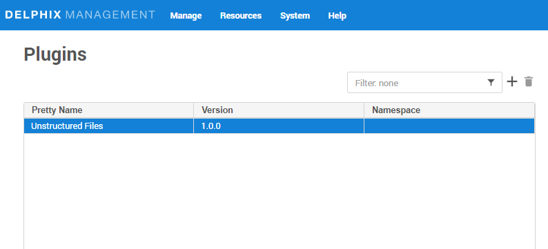
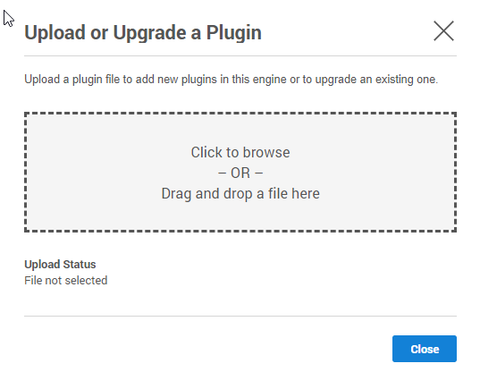
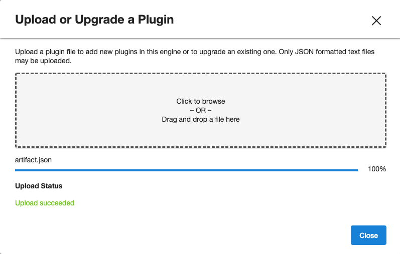

# Installation

Delphix plugin for mongoDB can be installed via GUI or using command prompt (developer environment)

Prerequisites
-------------

- Install delphix engine 5.3.x and above  
- Install mongo binaries on staging and target servers  

Install MongoDB Plugin
----------------------
Following 2 methods can be used for upload mongo plugin to delphix appliance.

### Using GUI

1. Click on Manage and then Plugins

2. Click on `+` icon

3. Click on Upload or Upgrade a plugin

4. Select the `build(artifacts.json)` 

5. Click on close button

6. See the plugin version in `Plugins` section

### Using dvp (from plugin development environment)
`dvp upload -e <Delphix_Engine_Name> -u <username> --password <password>`

Delphix Engine's documentation on installing plugins: [PluginManagement](https://docs.delphix.com/docs/datasets/unstructured-files-and-app-data/delphix-engine-plugin-management)
