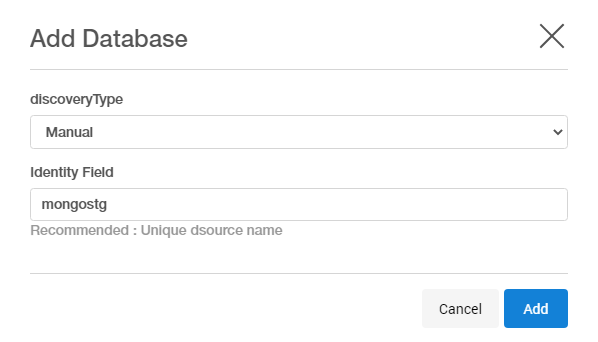
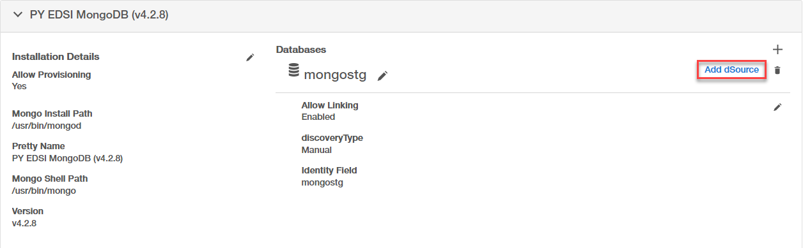

# Linking

Linking a data source will create a dSource object on the engine and allow Delphix to ingest data from this source. The dSource is an object that the Delphix Virtualization Engine uses to create and update virtual copies of your database. 

Prerequisites
-------------

- Install delphix engine 5.3.x and above  
- Install mongo binaries on staging host  
- Execute Discovery on staging host  

Create Sourceconfig
----------------------
Every environment contains `repositories` and each environment may have any number of repositories associated with it. `Repository` represents the binaries for mongo instance. Each repository can have many `SourceConfig` which represent mongo instance. There is no sourceconfig generated automatically in mongo-plugin. We need to configure `SourceConfig` objects through which we can create a dSource. 

1. Login to the Delphix Management application.
2. Click Manage.
3. Select Environments.
4. Select the repository
5. Click on `+` icon ( Shown in next image )

    

6. Add required details in `Add database` section.  
 - `identity field`: Proivide unique name for staging database
 - `discoveryType`: Keep it as manual
 - Click `Add` button

    

Create dSource
--------------
dSource is delphix representation of source database copy. Following are the steps to create dSource.

1. Login to Delphix Management application.
2. Click Manage >  Datasets
3. Click on `Add dSource`.
    
4. In the Add dSource wizard, select the mongo source config you just created on the staging host.
5. Select the dSource type from the drop-down available on dSource wizard. Refer different [dSource Types](https://delphix.github.io/mongo-plugin/index.html#ingestion-types)  
6. Enter the mongo-specific parameters for your dSource configuration.  
7. Proceed with wizard and submit to create dSource.  

**Note:** For stagingpush dSource Type, Please ignore 1st snapshot. Once the staging instance is created by user, take a new snapshot and delete previous snapshot to avoid empty datafile/file provisioning.

dSource Parameters
------------------

| Parameter      | Description  | dSource Type |
| :------------- | :---------- | :---------- |
| dSource Type   | Type of dSource | seed, shardedsource, nonshardedsource, offlinemongodump, onlinemongodump |
| Source MongoDB Host Connct String | Source Instance Connect String | onlinemongodump |
| MongoDB Source Database User | Source database user | onlinemongodump |
| MongoDB Password | Source database password | onlinemongodump |
| Enable logsync | Capture oplogs | onlinemongodump |
| Staging MongoDB Host | Staging host for creating dSource | seed, shardedsource, nonshardedsource, offlinemongodump, onlinemongodump |
| Staging Port | Staging Port for Mongo Instance | seed, shardedsource, nonshardedsource, offlinemongodump, onlinemongodump |
| Mongos Port | Port to be used for mongos | shardedsource |
| bindIP String | default 0.0.0.0 | seed, shardedsource, nonshardedsource, offlinemongodump, onlinemongodump |
| Oplog Size | Size of oplogs | seed, shardedsource, nonshardedsource, offlinemongodump, onlinemongodump |
| Journal commit Interval | Internal in ms | seed, shardedsource, nonshardedsource, offlinemongodump, onlinemongodump |
| Storage Engine | Storage Engine - wiredTiger | seed, shardedsource, nonshardedsource, offlinemongodump, onlinemongodump |
| Mount Path | Mount Path for instance datafiles | seed, shardedsource, nonshardedsource, offlinemongodump, onlinemongodump |
| Backup Metadata File Name | Backup datetime - Content : MMDDYYYY_HH24MISS | seed, shardedsource, nonshardedsource, offlinemongodump, onlinemongodump |
| Mongo Admin User | Mongo Admin User on Staging Host | seed, shardedsource, nonshardedsource, offlinemongodump, onlinemongodump |
| MongoDB Password | Mongo Admin User Password on Staging Host | seed, shardedsource, nonshardedsource, offlinemongodump, onlinemongodump |
| Source Sharded Cluster | Is Source Sharded Cluster | shardedsource |
| Config Server Backup File (sharded mongo)   replicaset backup file (nonsharded mongo)   Backup directory for Mongodump | Config Server Backup File Name   replicaset backup file (nonsharded mongo)   Backup directory for Mongodump | shardedsource   offlinemongodump, onlinemongodump   offlinemongodump, onlinemongodump |
| Shard Backup Files | Shard Backup File Full Path. Add File for each Shard | shardedsource |
| Enable SSL/TLS | Enable SSL/ TLS | seed, shardedsource, nonshardedsource, offlinemongodump, onlinemongodump |
| SSL/TLS Parameters | SSL/TLS Parameters (tlsMode, tlsCAFile, tlsPEMKeyFile, sslAllowConnectionsWithoutCertificates) | seed, shardedsource, nonshardedsource, offlinemongodump, onlinemongodump |
| Enable Authentication | Enable Authentication | seed, shardedsource, nonshardedsource, offlinemongodump, onlinemongodump |
| User Auth Mode | "None","SCRAM","x509","ldap" | seed, shardedsource, nonshardedsource, offlinemongodump, onlinemongodump |
| keyfile_path | KeyAuth keyfile name (Full Path) | seed, shardedsource, nonshardedsource, offlinemongodump, onlinemongodump |

**Note:** For offlinemongodump, nonsharded and sharded Ingestion types, Backup Metadata File content need to be updated manually OR as a part of backup script. Content of file is just 1 line date in format MMDDYYYY_HH24MISS which indicates date last backup was taken and presented to staging host. Delphix checks this file based on snapsync policy to find if new backup is available for ingestion. No other checks on backups are done. If date is updated, delphix runs snapsync to ingest new backup.

