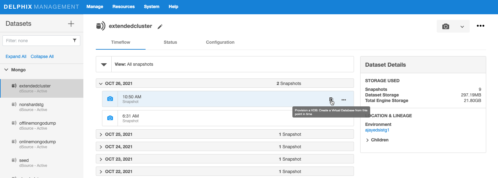
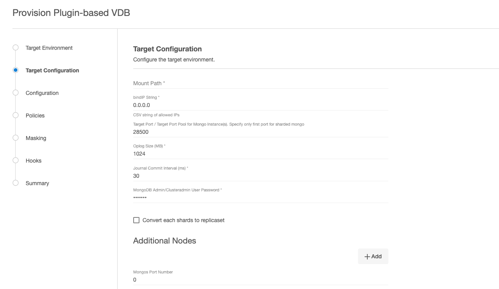

# Provisioning

This topic describes the basic concepts involved with provisioning VDBs for Mongo.

A dSource is a virtualized representation of a physical or logical source database. You must create a virtual database (VDB) from a dSource snapshot. A VDB is an independent, writable copy of a dSource snapshot. You can also create VDBs from other VDBs. Once you have provisioned a VDB to a target environment, you can also implement snapshot and retention policies for the VDB, which will determine how frequently Delphix Engine will take a database snapshot and how long the snapshots will be retained for recovery and provisioning purposes.

Snapshots accumulate over time. To view a snapshot:

1. From the Datasets panel, click the group containing the dSource.
2. Select dSource.
3. Click the TimeFlow tab.

The TimeFlow appears as a list of dates, each of which expands to show snapshots from that date. Bring the cursor on desired snapshot of dSource, provision icon appears, click on provision icon.  
Provide parameters to provision VDB, Follow the wizard and submit to provision VDB. Once you provisioned a VDB, you can also take snapshots of it. As with the dSource snapshots, you can find these when you select the VDB in the Datasets panel. You can then provision additional VDBs from these VDB snapshots.

Provisioning VDB
----------------
This topic describes how to provision a virtual database (VDB) from a mongo dSource.

Prerequisites
-------------

- Install delphix engine 5.3.x and above  
- Install mongo binaries on Staging host 
- Add Staging Environment
- Create dSource
- Install mongo binaries on Target host  
- Add Target environment  

Create VDB
----------
Procedure:

1. Login to the Delphix Management GUI.  
2. Click Manage.  
3. Select Datasets.  
4. Select a dSource.  
5. Select a snapshot from which you want to provision.  
6. Click Provision VDB icon to open Provision VDB wizard. 

     

7. Select a target environment from the left pane.  
8. Select an Installation to use from the dropdown list of available mongo binaries on that environment.  
9. Select the Environment User.  
10. Enter VDB parameters.  

     

11. Select a Target Group for the VDB.  
12. Click the green Plus icon to add a new group, if necessary.  
13. Select a Snapshot Policy for the VDB.  
14. Click Next.  
15. Specify any desired hook operations.  
16. Click Next.  
17. Review the Provisioning Configuration and Data Management information.  
18. Click Submit.  

When provisioning starts, you can review the progress of the job in the Databases panel, or in the Job History panel of the Dashboard. When provisioning is complete, the VDB will be included in the group you designated and listed in the Databases panel. If you select the VDB in the Databases panel and click the Open icon, you can view its card, which contains information about the database and its Data Management settings.
