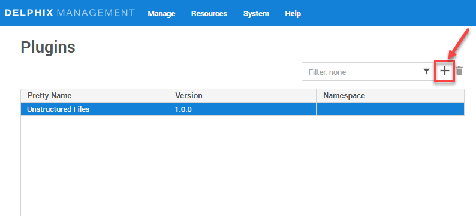
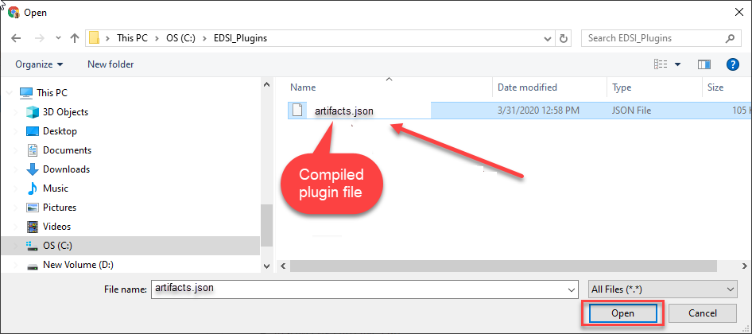
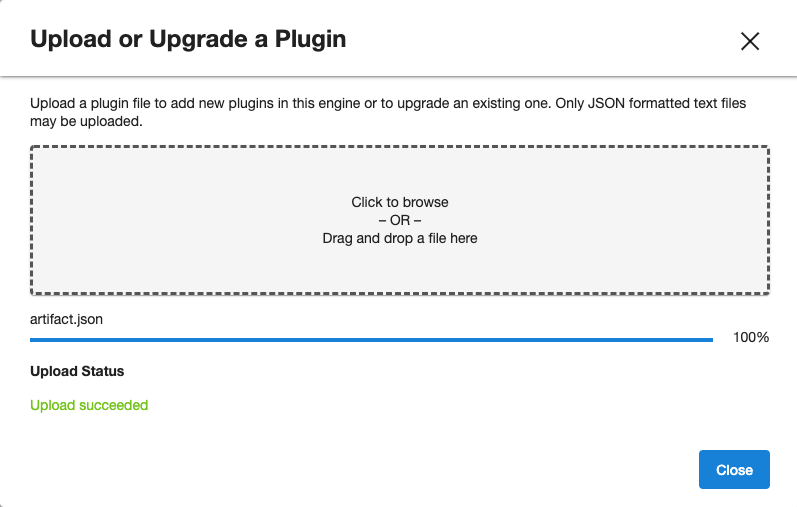

# Install Plugin

Delphix plugin for MongoDB can be installed via GUI or using command prompt (developer environment)

Prerequisites
-------------

- Install delphix engine compatible with the MongoDB plugin version as per [support matrix](Requirements/SupportMatrix.md)

Install MongoDB Plugin
----------------------

Following 2 methods can be used for upload Mongo plugin to Delphix DevOps Platform.

## Using GUI

1. Click on Manage and then Plugins

2. Click on `+` icon

3. Click on Upload or Upgrade a plugin

4. Select the `build(artifacts.json)`

5. Click on close button

6. See the plugin version in `Plugins` section

## Using dvp (on command prompt)

`dvp upload -a <Plugin-artifact.json> -e <Delphix_Engine_Name> -u <username> --password <password>`

Delphix Engine's documentation on installing plugins: [PluginManagement](https://docs.delphix.com/docs/datasets/unstructured-files-and-app-data/delphix-engine-plugin-management)
