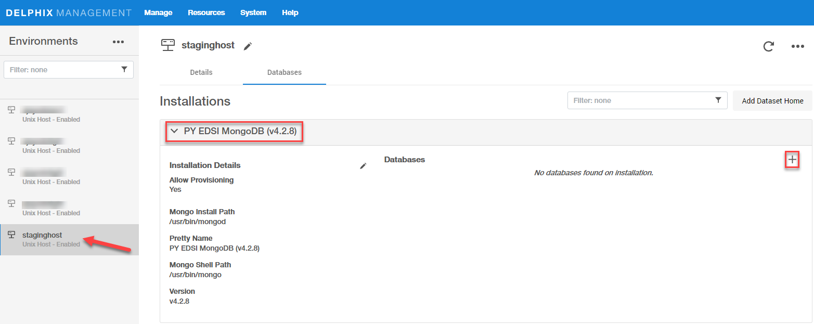

# Linking

Linking a data source will create a dSource object on the engine and allow Delphix to ingest data from this source. The dSource is an object that the Delphix Virtualization Engine uses to create and update virtual copies of your database. 

Prerequisites
-------------

- Install delphix engine 5.3.x and above  
- Install mongo binaries on staging host  
- Execute Discovery on staging host  
- Create sourceConfig on staging host 

Create dSource
--------------
dSource is delphix representation of source database copy. Following are the steps to create dSource.

1. Login to Delphix Management application.
2. Click Manage >  Datasets
3. Select Add dSource.
4. In the Add dSource wizard, select the mongo source config you just created on the staging host.
5. Select the dSource type from the drop-down available on dSource wizard. Refer different [dSource Types](https://delphix.github.io/mongo-plugin/index.html#ingestion-types)
6. Enter the mongo-specific parameters for your dSource configuration.

dSource Parameters
------------------

| Parameter      | Description  | dSource Type |
| :------------- | :---------- | :---------- |
| dSource Type   | Type of dSource | seed, shardedsource, nonshardedsource, offlinemongodump, onlinemongodump |
| Source MongoDB Host Connct String | Source Instance Connect String | onlinemongodump |
| MongoDB Source Database User | Source database user | onlinemongodump |
| MongoDB Password | Source database password | onlinemongodump |
| Enable logsync | Capture oplogs | onlinemongodump |
| Staging MongoDB Host | Staging host for creating dSource | seed, shardedsource, nonshardedsource, offlinemongodump, onlinemongodump |
| Staging Port | Staging Port for Mongo Instance | seed, shardedsource, nonshardedsource, offlinemongodump, onlinemongodump |
| Mongos Port | Port to be used for mongos | shardedsource |
| bindIP String | default 0.0.0.0 | seed, shardedsource, nonshardedsource, offlinemongodump, onlinemongodump |
| Oplog Size | Size of oplogs | seed, shardedsource, nonshardedsource, offlinemongodump, onlinemongodump |
| Journal commit Interval | Internal in ms | seed, shardedsource, nonshardedsource, offlinemongodump, onlinemongodump |
| Storage Engine | Storage Engine - wiredTiger | seed, shardedsource, nonshardedsource, offlinemongodump, onlinemongodump |
| Mount Path | Mount Path for instance datafiles | seed, shardedsource, nonshardedsource, offlinemongodump, onlinemongodump |
| Backup Metadata File Name | Backup datetime - Content : MMDDYYYY_HH24MISS | seed, shardedsource, nonshardedsource, offlinemongodump, onlinemongodump |
| Mongo Admin User | Mongo Admin User on Staging Host | seed, shardedsource, nonshardedsource, offlinemongodump, onlinemongodump |
| MongoDB Password | Mongo Admin User Password on Staging Host | seed, shardedsource, nonshardedsource, offlinemongodump, onlinemongodump |
| Source Sharded Cluster | Is Source Sharded Cluster | shardedsource |
| Config Server Backup File (sharded mongo)   replicaset backup file (nonsharded mongo)   Backup directory for Mongodump | Config Server Backup File Name   replicaset backup file (nonsharded mongo)   Backup directory for Mongodump | shardedsource   offlinemongodump, onlinemongodump   offlinemongodump, onlinemongodump |
| Shard Backup Files | Shard Backup File Full Path. Add File for each Shard | shardedsource |
| Enable SSL/TLS | Enable SSL/ TLS | seed, shardedsource, nonshardedsource, offlinemongodump, onlinemongodump |
| SSL/TLS Parameters | SSL/TLS Parameters (tlsMode, tlsCAFile, tlsPEMKeyFile, sslAllowConnectionsWithoutCertificates) | seed, shardedsource, nonshardedsource, offlinemongodump, onlinemongodump |
| Enable Authentication | Enable Authentication | seed, shardedsource, nonshardedsource, offlinemongodump, onlinemongodump |
| User Auth Mode | "None","SCRAM","x509","ldap" | seed, shardedsource, nonshardedsource, offlinemongodump, onlinemongodump |
| keyfile_path | KeyAuth keyfile name (Full Path) | seed, shardedsource, nonshardedsource, offlinemongodump, onlinemongodump |

Create Sourceconfig
----------------------
Every environment contains `repositories` and each environment may have any number of repositories associated with it. `Repository` represents the binaries for mongo instance. Each repository can have many `SourceConfig` which represent mongo instance. There is no sourceconfig generated automatically in mongo-plugin. We need to configure `SourceConfig` objects through which we can create a dSource. 

1. Login to the Delphix Management application.
2. Click Manage.
3. Select Environments.
4. Select the repository
5. Click on `+` icon ( Shown in next image )

    

6. Add required details in `Add database` section.  
 - `identity field`: Proivide unique name for staging database
 - `discoveryType`: Keep it as manual
 - Click `Add` button

    

Create dSource
----------------------
dSource is delphix representation of source database copy. It can be of several different types.  

1. Create sourceConfig under repository of staging environment  
2. Click on `Add dSource` link.  
 
    

3. Select appropriate dSource Type
4. Enter mongo-specific parameters for your dSource configuration.
5. Proceed with wizard and submit to create dSource.

### Seed
This type of dSource is generally used for pure development purpose. There is no source instance associated with it. It creates a empty instance which is managed by delphix and helps to create virtual mongo instance to avail benefits of all delphix features.

### Mongodump (offline)
This type of dsource is created using mongodump backup file of source mongo instance. It helps to create dsource using zero touch production. Periodic backups can be loaded to create timeline of dsource.

### Mongodump (online)
This type of dsource is created using mongodump backup file of source mongo instance. It helps to create dsource using online backup. It can run in regular mode or logsync mode. logsync mode helps to capture oplogs for incremental snapsyncs and reduce backup time and size. Periodic backups can be loaded to create timeline of dsource.

### Online replicaset
This type of dsource is created by adding secondary member to existing source cluster. This member does not participate in voting and never becomes primary nor serves any read operations. Its the fastest way of capturing incremental and multiple snapshots can be taken to get desired timeline.

### Mongo OPS Manager backups (sharded cluster)
This type of dsource is created using backup file of source mongo instance created by mongo ops manager. It helps to create dsource of sharded source cluster. It helps to create dsource using zero touch production. Periodic backups can be loaded to create timeline of dsource.

### Mongo OPS Manager backups (non-sharded cluster)
This type of dsource is created using backup file of source mongo instance created by mongo ops manager. It helps to create dsource of non-sharded source cluster. It helps to create dsource using zero touch production. Periodic backups can be loaded to create timeline of dsource.
