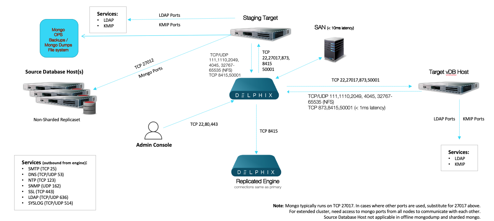

# Network Port Requirements
The following diagram describes the port allocations for Mongo environments. It illustrates the ports that we recommend to be open from Delphix to remote services, to the Delphix Engine, and to the Target Environments. 

