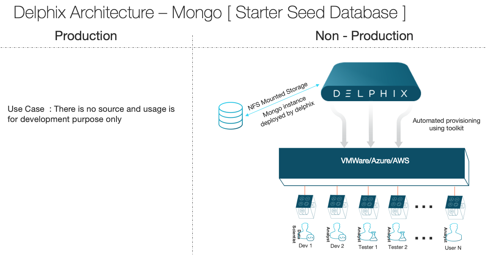
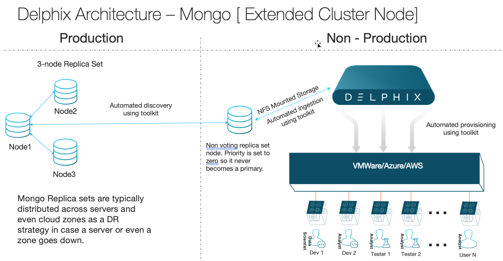
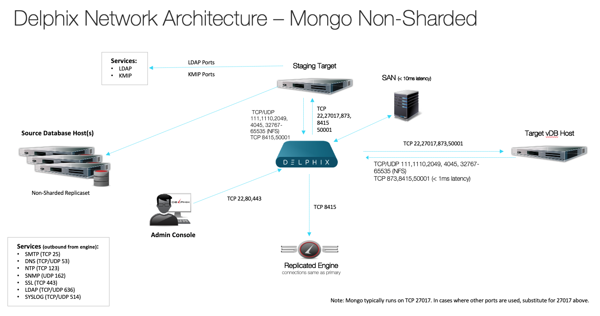
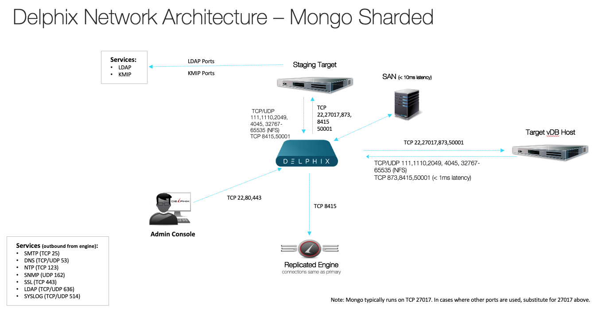

# Overview

MongoDB plugin helps to virtualize mongoDB data source leveraging the following built-in mongoDB technologies:

Supported Backup Mechanisms:

- **Mongodump**        : Export source data and import into Staging mongo instance (dSource). Useful for offline/online backups of small databases (onprem, Saas, MongoAtlas)
- **Replication**      : Add replicaset member to existing cluster.
- **Mongo Ops Manager**: Use existing backups downloaded as compressed file(s) from Mongo OPS Manager.

Mongo plugin allows you to use Mongo Ops Manager / Mongodump Backups as the source of dataset in Delphix. It also supports to setup replication cluster node to collect instant data. Mongo Plugin supports following use cases :

1. MongoDB cluster/single instance offline backups using mongodump mechanism (Zero Touch Production).
2. MongoDB cluster/single instance online backups using mongodump mechanism.
3. MongoDB extended cluster replicaset by adding replicaset member to existing source cluster using delphix filesystem.
4. MongoDB sharded Cluster using Mongo OPS Manager backups (Zero Touch Production).
5. MongoDB non-sharded Cluster using Mongo OPS Manager backups (Zero Touch Production).
6. MongoDB seed database

## Architecture






Support Matrix
--------------
### <a id="support matrix"></a>Mongo Instance / OS Support Matrix
| Mongo Versions                     | RHEL 6.4                         | RHEL 7.4                         | RHEL 7.9                         | Windows x.x |
| :-------------       | :----------                      | :----------:                     | :----------                      | :---------- |
| mongoDB 4.2          |    |    |    |  |
| mongoDB 4.4          | -                                |    |    |  |
| mongoDB 4.2(sharded) |    |    |    |  |
| mongoDB 4.4(sharded) | -                                |    |    |  |

### <a id="engine_compatibility_matrix"></a>Engine Compatibility Matrix
| Engine Versions      | Mongo 4.4.2                      | Mongopy 0.0.9                    |
| :-------------       | :----------                      | :----------:                     |
| 5.2.x.x              |    |    |
| 5.3.5.x              |    |    |
| 6.0.2.x              |    |    |
| >6.0.3.x - 6.0.10.0  |    |    |

Prerequisites
-------------
### <a id="source requirements-plugin"></a>Source Requirements
- Access to Source SSL Certificate (if applicable)  
- Access to KMIP Credentials (if applicable)  
- Access to Encryption KeyFile (if applicable)  
- Backup files from Mongo Ops Manager / Offline mongodump presented to Staging host.

***Database user with following privileges ( for extendedcluster dSource type ) ***  
- clusterAdmin  
- changeOwnPasswordRole  

```shell
use admin
db.createRole(
   { role: "changeOwnPasswordRole",
     privileges: [
        {
          resource: { db: "", collection: ""},
          actions: [ "changeOwnPassword" ]
        }
     ],
     roles: []
   }
)
db.createUser({user: "clusteradmin",pwd: "xxxxxx", roles: ["clusterAdmin","changeOwnPasswordRole"]})
```

***Database user with following privileges ( for onlinemongodump dSource type ) ***  
```
use admin 
db.createUser({user: "clusteradmin",pwd: "xxxxxx", roles: ["clusterAdmin","userAdminAnyDatabase"]})
```

### <a id="staging requirements-plugin"></a>Staging Requirements
***O/S user with following privileges***  
1. Regular o/s user with primary group as mongod.  
2. Execute access on mongo/mongod binaries  
3. mongo and mongod binaries to be in same folder [ if required create softlink ]
4. Empty folder on host to hold delphix toolkit  [ approximate 2GB free space ]  
5. Empty folder on host to mount nfs filesystem. This is just an empty folder with no space requirements and act as base folder for nfs mounts.  
6. Access to source instance backup file(s) from Staging host logged as delphix user (applicable for mongo ops mgr / offline mongodump use case).
7. sudo privileges for mount, umount. See sample below assuming `delphix_os` is used as delphix user.  

```shell
Defaults:delphixos !requiretty
delphixos ALL=NOPASSWD: \
/bin/mount, /bin/umount
```  

###### Network Port requirements



### <a id="target requirements-plugin"></a>Target Requirements  
***O/S user with following privileges***  
1. Regular o/s user with primary group as mongod.  
2. Execute access on mongo/mongod binaries  
3. mongo and mongod binaries to be in same folder [ if required create softlink ]
4. Empty folder on host to hold delphix toolkit  [ approximate 2GB free space ]  
5. Empty folder on host to mount nfs filesystem. This is just an empty folder with no space requirements and act as base folder for nfs mounts.  
6. sudo privileges for mount, umount. See sample below assuming `delphix_os` is used as delphix user.  

```shell
Defaults:delphixos !requiretty
delphixos ALL=NOPASSWD: \
/bin/mount
```

###### Network Port requirements


Limitations
-----------
- V2P Not supported
- Password Vault not supported
- PITR
