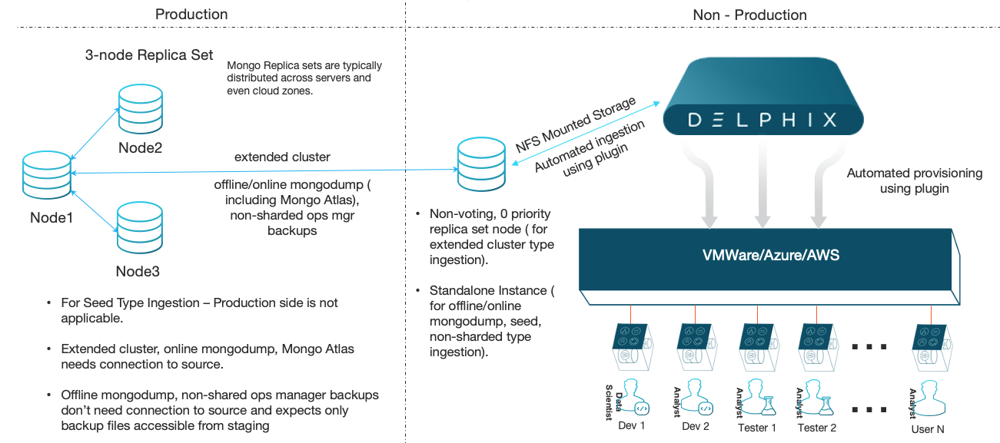
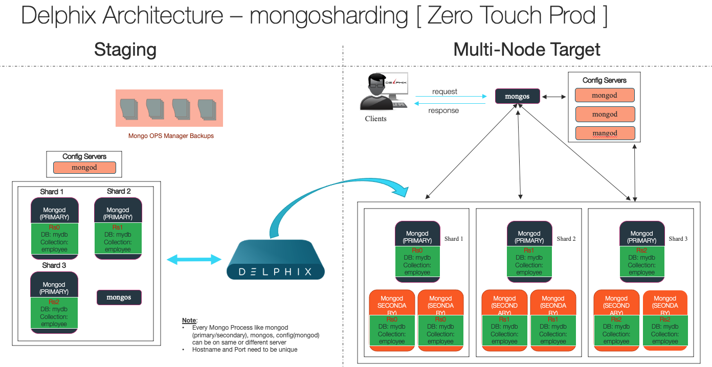

# Overview

MongoDB plugin helps to virtualize mongoDB data source leveraging the following built-in mongoDB technologies:

Supported Backup Mechanisms:

- **New Instance**     : Delphix creates new mongo instances when there is no source associated for ingestion.
- **Mongodump**        : Export source data and import into Staging mongo instance (dSource). Useful for offline/online backups of small databases (onprem, Saas, MongoAtlas)
- **Replication**      : Add replicaset member to existing cluster.
- **Mongo Ops Manager**: Use existing backups downloaded as compressed file(s) from Mongo OPS Manager.


#### <a id="Ingestion_Types"></a> Ingestion Types:

| dSource Type         | Mechanism                        | Zero Touch Prod | Description |
| :-------------       | :----------                      | :----------: | :---------- |
| Seed                 | New Mongo Instance               | -                   | New empty mongo instance created by delphix. This is for development purpose without any source |
| extendedcluster      | Add member to existing replicaset| N | Add member to existing source replicaset. Instant and near realtime snapshots |
| onlinemongodump      | mongodump                        | N | Delphix connects to source from staging environments, executes mongodump and capture source data. |
| offlinemongodump     | mongodump                        | Y | Delphix leverages existing mongodumps made available to staging host. Supports backups taken using "mongodump --oplog --gzip -o < bkp_dir >" command |
| shardedsource        | Mongo OPS Manager Backups        | Y | Delphix leverages existing mongo ops manager backups of sharded source as backup files presented to staging host |
| nonshardedsource     | Mongo OPS Manager Backups        | Y | Delphix leverages existing mongo ops manager backups of non sharded source as backup files presented to staging host |
| stagingpush          | User created mongo instance      | Y/N | New empty mongo instance created by user or mongo ops manager automation. User responsible to create working mongo instance on staging host |

### <a id="Seed"></a>Seed
This type of dSource is generally used for pure development purpose. There is no source instance associated with it. It creates a empty instance which is managed by delphix and helps to create virtual mongo instance to avail benefits of all delphix features.


### <a id="Mongodump_offline"></a>Mongodump (offlinemongodump)
This type of dsource is created using mongodump backup file of source mongo instance. It helps to create dsource using zero touch production. Periodic backups can be loaded to create timeline of dsource.

### <a id="Mongodump_online"></a>Mongodump (onlinemongodump)
This type of dsource is created using mongodump backup file of source mongo instance. It helps to create dsource using online backup. It can run in regular mode or logsync mode. logsync mode helps to capture oplogs for incremental snapsyncs and reduce backup time and size. Periodic backups can be loaded to create timeline of dsource.

### <a id="online_replicaset"></a>Extended Cluster (extendedcluster)
This type of dsource is created by adding secondary member to existing source cluster. This member does not participate in voting and never becomes primary nor serves any read operations. Its the fastest way of capturing incremental and multiple snapshots can be taken to get desired timeline.

### <a id="opsmgr_sharded"></a>Mongo OPS Manager backups (sharded mongo)
This type of dsource is created using backup file of source mongo instance created by mongo ops manager. It helps to create dsource of sharded source cluster. It helps to create dsource using zero touch production. Periodic backups can be loaded to create timeline of dsource.

### <a id="opsmgr_nonsharded"></a>Mongo OPS Manager backups (non-sharded mongo replicaet)
This type of dsource is created using backup file of source mongo instance created by mongo ops manager. It helps to create dsource of non-sharded source cluster. It helps to create dsource using zero touch production. Periodic backups can be loaded to create timeline of dsource.

### <a id="stagingpush"></a>Staging Push ( Mongo OPS Manager with Automation ) (stagingpush)
This type of dsource is similar to extended cluster. When Mongo Ops Manager is configured with automation, it does not allow any cluster modification commands outside Mongo Ops Manager. When creating dsource of staging push type, delphix creates an empty filesystem on staging host. You can create mongo instance using Mongo Ops Manager on delphix filesystem and take new delphix snapshot. Delete any previous snapshot generateed before creating mongo instance. Delphix will take periodic snapshots based on snapsync policy which can be used to create VDBs.
## Architecture  
#### Consolidated Seed, Extended Cluster, Offline/Online mongodump, Mongo Atlas, Non-Sharded Ingestion Types 


#### Sharded Mongo Ingestion Type 


## Network Port requirements
#### Delphix Network Architecture 


Support Matrix
--------------
### <a id="support matrix"></a>Mongo Instance / OS Support Matrix
| Mongo Versions       | RHEL 6.4                         | RHEL 7.4                         | RHEL 7.9                         | Windows x.x |
| :-------------       | :----------                      | :----------:                     | :----------                      | :---------- |
| mongoDB 4.2          |    |    |    |  |
| mongoDB 4.4          | -                                |    |    |  |
| mongoDB 4.2(sharded) |    |    |    |  |
| mongoDB 4.4(sharded) | -                                |    |    |  |

### <a id="engine_compatibility_matrix"></a>Engine Compatibility Matrix
| Engine Versions      | Mongo 4.0.x                      | Mongo 4.2.x                      | Mongo 4.4.x                      | Mongo 4.4.2                      |
| :-------------       | :----------                      | :----------                      | :----------                      | :----------:                     |
| 5.2.x.x              |    |    |    |    |
| 5.3.5.x              |    |    |    |    |
| 6.0.2.x              |    |    |    |    |
| >6.0.3.x - 6.0.10.0  |    |    |    |    |

- Engine 5.2.x.x - 5.3.4.0 supported with legacy plugin ( mongo 4.4.2 )  
- Engine 5.3.5.0 - 6.0.10.0 supported with current plugin ( mongopy 0.0.9 )  


### <a id="mongo_version_environment_compatibility_matrix"></a>Mongo Version compatability across delphix environments
- Mongo binaries in all environments ( staging and target ) should be of same version for dSource Type: Seed
- Mongo binaries in all environments ( source, staging and target ) should be of same version for dSource Type: extendedcluster, nonshardedmongo, shardedmongo and stagingpush
- Mongo binaries can be of same or higher version than source in staging environment for offlinemongodump, onlinemongodump 

Prerequisites
-------------
### <a id="source requirements-plugin"></a>Source Requirements
- Access to Source SSL Certificate (if applicable)  
- Access to KMIP Credentials (if applicable)  
- Access to Encryption KeyFile (if applicable)  
- Backup files from Mongo Ops Manager / Offline mongodump presented to Staging host.

***Database user with following privileges ( for extendedcluster dSource type ) ***  
- clusterAdmin  
- changeOwnPasswordRole  

```shell
use admin
db.createRole(
   { role: "changeOwnPasswordRole",
     privileges: [
        {
          resource: { db: "", collection: ""},
          actions: [ "changeOwnPassword" ]
        }
     ],
     roles: []
   }
)
db.createUser({user: "clusteradmin",pwd: "xxxxxx", roles: ["clusterAdmin","changeOwnPasswordRole"]})
```

***Database user with following privileges ( for onlinemongodump dSource type ) ***  
```
use admin 
db.createUser({user: "clusteradmin",pwd: "xxxxxx", roles: ["clusterAdmin","backup"]})
```

### <a id="staging requirements-plugin"></a>Staging Requirements
***O/S user with following privileges***

- Regular o/s user with primary group as mongod.  
- Execute access on mongo/mongod binaries  
- mongo and mongod binaries to be in same folder [ if required create softlink ]  
- Empty folder on host to hold delphix toolkit  [ approximate 2GB free space ]  
- Empty folder on host to mount nfs filesystem. This is just an empty folder with no space requirements and act as base folder for nfs mounts.  
- Access to source instance backup file(s) from Staging host logged as delphix user (applicable for mongo ops mgr / offline mongodump use case).  
- sudo privileges for mount, umount. See sample below assuming `delphix_os` is used as delphix user.  

```shell
Defaults:delphixos !requiretty
delphixos ALL=NOPASSWD: \
/bin/mount, /bin/umount
```  


### <a id="target requirements-plugin"></a>Target Requirements  
***O/S user with following privileges***  

- Regular o/s user with primary group as mongod.  
- Execute access on mongo/mongod binaries  
- mongo and mongod binaries to be in same folder [ if required create softlink ]  
- Empty folder on host to hold delphix toolkit  [ approximate 2GB free space ]  
- Empty folder on host to mount nfs filesystem. This is just an empty folder with no space requirements and act as base folder for nfs mounts.  
- sudo privileges for mount, umount. See sample below assuming `delphix_os` is used as delphix user.  

```shell
Defaults:delphixos !requiretty
delphixos ALL=NOPASSWD: \
/bin/mount
```
Limitations
-----------
- V2P not supported
- Password Vault not supported
- PITR not supported
